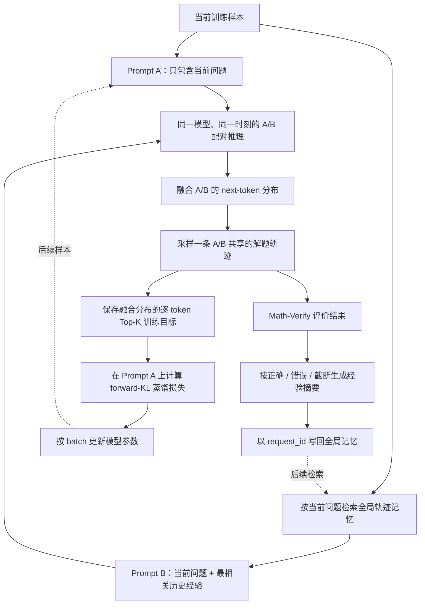

# 2nd-Order-Reasoner：基于轨迹记忆与在线自蒸馏的持续学习

## 1. 项目定位

2nd-Order-Reasoner 的主要目标，是让模型在持续到来的任务中积累经验，并把这些经验逐步内化到模型参数中。

普通语言模型在处理每个新问题时，通常只依赖当前上下文。一次解题中形成的有效策略、失败原因和检查方法，在上下文结束后不会自动影响下一次解题。本项目为此引入两个相互配合的学习环：

1. **轨迹记忆环**：每完成一个任务，就立即保存问题、解题轨迹、结果评价和经验摘要；遇到新问题时，检索最相关的历史经验。
2. **参数学习环**：让“只看当前问题”的分布 A 与“额外看到相关经验”的分布 B 共同决定本次生成，再把这个更有信息的融合分布蒸馏回只依赖 A 的模型。

因此，这里的持续学习不是简单地把历史答案拼进上下文，也不是每生成一个样本就立刻做一次梯度更新，而是：

> 记忆库按轨迹快速更新，模型参数按训练 batch 较慢更新；外部经验不断被检索、验证、压缩，并通过在线自蒸馏逐步转化为模型自身的能力。

当前仓库重点实现数学题场景，但底层 OPSD 记忆组件被设计为可复用基础设施，后续可以扩展到代码、工具调用和多轮 Agent 任务。

本项目基于 [verl](https://github.com/verl-project/verl) 构建。底层训练框架的原始介绍、安装方式和通用功能请参阅 [README_VERL.md](README_VERL.md)；本文重点说明 2nd-Order-Reasoner 在持续学习方向新增的算法与实现。

## 2. “二阶推理”是什么意思

这里的“二阶”不是数值优化中的二阶梯度、Hessian 或牛顿法。

- **一阶推理**关注“当前问题的答案是什么”。
- **二阶推理**进一步关注“过去采用了什么方法、为什么成功或失败、哪些经验可以迁移到当前问题，以及怎样把这类经验变成未来无需显式记忆也能使用的能力”。

模型处理的不再只有任务本身，还包括对推理过程的评价、总结和复用。也就是说，系统既生成解题轨迹，也持续学习“如何改进解题轨迹”。

## 3. 整体流程

一次训练轨迹的顺序可以概括为：

> 检索最相关记忆 → 构造 Prompt B → A/B 配对融合推理 → 验证并总结轨迹 → 写回记忆 → 组 batch 蒸馏训练。

### 3.1 构造 Prompt A

Prompt A 是正常的任务输入，只包含当前问题及其原始对话模板。它代表模型在没有外部经验帮助时，实际需要具备的解题能力。

### 3.2 检索全局轨迹记忆

系统用当前问题的文本向量查询一个由 Ray Actor 持有的全局记忆库，通过余弦相似度选出最相关的一条历史记录。

记忆库以 `request_id` 为主键。每条数学轨迹可以包含：

- 原问题 `prompt`；
- 完整生成轨迹 `trajectory`；
- 经验摘要 `summary`；
- 用于相似度检索的 `embedding`；
- A/B 两个实际对话历史 `trajectory_a` 和 `trajectory_b`；
- 标准答案 `ground_truth`；
- 检索来源、相似度、验证结果、是否截断等审计信息。

内存容量是有界的，当前使用插入顺序淘汰旧记录。可通过 JSONL 日志即时持久化轨迹，也可以在新任务启动时用历史日志重建记忆。

### 3.3 构造 Prompt B

如果检索到历史经验，Prompt B 会同时包含：

- 历史问题；
- 历史经验摘要；
- 历史形式化回答；
- 当前问题。

Prompt B 不是让模型照抄旧答案，而是为同一模型提供一个带有“相关解题经验”的特权上下文。当前数学实现保存完整历史轨迹用于审计，但在复用轨迹时会移除 `<think>...</think>` 中的私有思维内容，只把可见的形式化回答放入 Prompt B。摘要生成也关闭 Qwen 的 thinking 模式。

如果记忆库尚为空，B 会直接复用 A。此时系统可以正常冷启动，只是暂时没有额外经验增益。

为了避免 Prompt B 挤占生成空间，代码对它设置独立 token 上限；超限时依次裁剪历史轨迹、历史摘要和历史问题，而当前问题保持不变。

### 3.4 A/B 配对融合推理

A 和 B 使用**同一组模型参数**，并作为同一个 mix-sglang PDS sample group 的两个成员，在一次原生 batch 中同步生成。

在生成位置 \(t\)，设两路分布分别为：

\[
p_A(y_t)=p_\theta(y_t\mid A,y_{<t}), \qquad
p_B(y_t)=p_\theta(y_t\mid B,y_{<t})
\]

当前实现采用加权平均概率融合：

\[
p_{\text{mix}}(y_t)=
\frac{w_Ap_A(y_t)+w_Bp_B(y_t)}{w_A+w_B}
\]

然后从 \(p_{\text{mix}}\) 采样下一个 token。两路请求共享已经生成的前缀，因此最终必须返回完全相同的 token 轨迹。

这一步有三个重要含义：

1. B 中的历史经验可以即时影响本次生成，而无需先更新参数。
2. A 仍然保留模型在普通上下文下的原始分布，可用于分析记忆带来了什么变化。
3. 不需要单独部署教师模型；带特权记忆的同一个模型承担了教师式引导作用。

Prompt B 参与每一步前向计算、分布融合和共享采样，但训练所需的概率载荷只由 Prompt A 返回，以避免重复传输。返回内容包括 A 的 source 分布和实际用于采样的 fused 分布，并保留逐 token Top-K token ID 与 log probability。

### 3.5 结果验证与 outcome-aware 经验总结

数学 AgentLoop 从数据集的 `reward_model.ground_truth` 读取标准答案，并用 Math-Verify 检查生成轨迹中的最终 boxed answer。

系统把轨迹分为三类：

- **正确**：总结有效的推理策略、关键中间结论和可靠性检查；
- **错误**：总结可能的推理、计算或验证错误，以及下一次应该改变或检查什么；
- **截断**：只总结已经完成的有效进展和仍缺失的步骤，不把不完整回答强行判断为正确或错误。

分类后的摘要连同完整 A/B 轨迹、验证分数和本次实际检索到的记忆一起写回全局记忆。这样，后续样本不仅能复用成功经验，也能利用失败和未完成轨迹提供的教训。

验证集 rollout 仍会执行验证和摘要，以便观测指标，但不会污染训练记忆库。

### 3.6 把记忆增强能力蒸馏回 Prompt A

生成时真正的行为策略是 \(p_{\text{mix}}\)。训练时，模型只在 Prompt A 的上下文上重新前向，并学习逼近生成时保存的 fused Top-K 分布。

对每个有效模型 token，当前 `forward_kl_topk` 目标可写成：

\[
\mathcal{L}_t
=
\sum_{i\in \operatorname{TopK}(p_{\text{mix}})}
p_{\text{mix}}(i)
\left[
\log p_{\text{mix}}(i)-\log p_\theta(i\mid A,y_{<t})
\right]
\]

总损失只在 `response_mask=1` 的模型生成位置上聚合。Top-K 中保存的是完整分布下的原始概率质量，不会在 Top-K 内重新归一化。

直观地说：

> 生成阶段让模型“参考记忆后再作答”，训练阶段再要求模型“只看当前问题，也尽量复现参考记忆后的判断”。

随着训练继续，历史经验对分布产生的有益偏移会逐渐进入参数。即使未来没有检索到完全相同的记忆，模型也有机会保留已内化的策略。

## 4. 为什么它是一种持续学习算法

本项目把持续学习拆成两个时间尺度。

### 4.1 快速适应：非参数轨迹记忆

每条训练轨迹完成后就可以写入记忆，不需要等待一次参数更新。下一条相似任务能够立即检索并使用它，因此系统具备跨样本的快速经验传递能力。

### 4.2 慢速内化：参数化在线自蒸馏

多条 rollout 组成 batch 后，fused 分布通过 forward-KL 更新模型参数。参数更新让经验从“必须检索才能使用的外部记忆”逐渐变成模型本身的行为倾向。

这两个环形成闭环：

\[
\text{新任务}
\rightarrow \text{检索旧经验}
\rightarrow \text{产生更好的新轨迹}
\rightarrow \text{评价与总结}
\rightarrow \text{写回记忆}
\rightarrow \text{蒸馏进参数}
\rightarrow \text{处理后续任务}
\]

它与常见方案的区别如下：

| 方案 | 历史经验如何使用 | 是否更新参数 | 本项目的差异 |
| --- | --- | --- | --- |
| 普通 RAG | 检索文档并拼接到输入 | 通常不更新 | 本项目检索的是经过结果评价的推理轨迹，并把增强后的分布继续蒸馏进参数 |
| 经验回放 | 重复训练历史样本 | 更新 | 本项目在当前任务生成时就让历史经验参与 token 分布融合，不只是重新播放旧样本 |
| 独立教师蒸馏 | 教师模型产生目标 | 更新学生 | 本项目的 A/B 使用同一模型，B 的特权记忆上下文提供教师式信号 |
| 纯在线 RL | 依赖奖励优化当前策略 | 更新 | 当前主路径使用验证结果塑造记忆摘要，参数目标则来自 A/B fused 分布的监督式 forward-KL |

## 5. 数据与训练信号

当前数学实现要求每条数据至少提供：

- 正常的 `prompt` / `raw_prompt`；
- `reward_model.ground_truth`，内容为字符串或标量数学答案；
- 可选的 `agent_name=math_memory_agent`，用于选择该 AgentLoop。

一次 rollout 返回的关键张量包括：

- `response_ids`：A/B 共享采样得到的轨迹；
- `response_logprobs`：fused 行为策略对已采样 token 的 log probability；
- `source_topk_ids/logprobs`：Prompt A 自身的 Top-K 分布；
- `fused_topk_ids/logprobs`：A/B 融合后的 Top-K 分布；
- `teacher_ids/logprobs`：供现有 distillation trainer 消费的 fused 目标别名。

目标分布按因果位置对齐到 `len(prompt_ids) - 1 + response_position`。如果未来扩展到工具调用或多轮环境交互，模型生成 token 使用 `response_mask=1`；工具和环境返回内容使用 `response_mask=0`，保留占位目标但不进入蒸馏损失。

## 6. 代码结构

| 模块 | 责任 |
| --- | --- |
| `verl/experimental/math_memory_agent/agent_loop.py` | 数学场景的完整状态机：读取标准答案、检索记忆、A/B 推理、Math-Verify、分类总结、写回和训练输出 |
| `verl/experimental/math_memory_agent/agent.yaml` | 数学 AgentLoop、向量模型、记忆容量、Prompt B 上限、验证器等配置 |
| `verl/experimental/agent_loop/opsd_memory_base.py` | 可复用的 OPSD 原语：Prompt A/B、配对生成、PDS 协议校验、目标对齐和记忆总结；基类本身不定义具体 `run` 状态机 |
| `verl/experimental/agent_loop/trajectory_memory.py` | `request_id` 记忆、向量化、余弦检索、容量淘汰、Ray 全局 Actor、JSONL 持久化与恢复 |
| `verl/workers/rollout/llm_server.py` | 把 A/B 路由到同一个 rollout replica 的 `generate_group` 接口 |
| `verl/workers/rollout/logprob_protocol.py` | 解析 mix-sglang 返回的 source/fused token 概率和 Top-K 概率协议 |
| `verl/experimental/agent_loop/agent_loop.py` | 对 AgentLoop 输出做 padding、batch 聚合，并把 rollout 目标交给 trainer |
| `verl/trainer/distillation/fsdp/losses.py` | FSDP 路径的 `forward_kl_topk` 计算；Megatron 路径有对应实现 |
| `examples/opsd_memory/` | 通用 OPSD 配置、启动脚本、协议说明和不依赖加速器的控制流 smoke test |

## 7. 关键设计选择

### 同权模型，而不是独立教师

A 与 B 来自同一个正在训练的模型。这样可以避免单独的教师资源池，也让目标分布始终与当前策略同步。配置中的 `distillation.target_source=rollout` 表示蒸馏目标直接由 rollout 返回。

### 共享一条采样轨迹

A/B 不是各自生成答案后再投票，而是在每个 token 位置先融合分布，再采样同一个 token。这样 source 与 fused 分布天然对应同一条轨迹，能够构造严格对齐的逐 token 训练目标。

### 记忆可审计

记录中不仅保存“用了哪条记忆”，还保存完整的 `metadata.retrieved_memory`、相似度、A/B 实际输入、答案验证结果和停止原因。这样可以回溯 Prompt B 的来源，分析一次增强或退化究竟由哪条历史经验引起。

### 失败关闭

实现会在以下情况直接报错，而不是静默使用不可靠目标：

- A/B 返回不同 token 轨迹；
- PDS 专用 source/fused 字段缺失；
- 概率数组与生成 token 数量不一致；
- Top-K 宽度不符合配置；
- 模型 token、响应位置与因果目标无法精确对齐；
- Prompt A 或不可裁剪的 Prompt B 固定内容超过预算。

普通 SGLang output logprob 不会被当作 PDS source/fused 概率的替代品。

## 8. 当前边界

这个仓库已经实现了持续学习闭环所需的主要控制流和数据协议，但仍应明确以下边界：

- 数学 AgentLoop 当前是单轮、纯文本实现；多轮工具/代码 Agent 需要基于 OPSD base 自己实现状态机。
- 当前检索只选择余弦相似度最高的一条记忆，还没有多记忆重排、质量加权或多样性约束。
- 记忆 Actor 是 detached 的；训练器 checkpoint 尚不会自动保存和恢复它，主要依赖 JSONL journal 与 seed 文件。
- 记忆按插入顺序淘汰，不等价于按价值、难度或新颖性管理长期记忆。
- Math-Verify 只为数学答案提供 outcome 信号；迁移到其他任务时需要相应的可执行验证器或奖励模型。
- Top-K forward-KL 是对完整分布 KL 的截断近似，效果取决于 K 值、Top-K 概率质量和 source/fused 分布重叠。
- 控制流 smoke test 只能证明检索、A/B 配对、协议解析、目标对齐和写回路径连通；真实 mix-sglang 调度、模型概率、Ray 并发以及 GPU/NPU 优化器更新仍需在对应运行环境中验证。
- 是否真正缓解灾难性遗忘、是否产生跨任务正迁移，最终需要用按时间顺序的数据流、旧任务回测和消融实验来验证，不能仅由代码闭环本身推出。

## 9. 建议的评估方式

为了判断持续学习是否有效，至少应同时记录：

1. **当前任务性能**：新数据上的正确率或验证分数。
2. **历史任务保持率**：每轮训练后回测旧任务，衡量遗忘程度。
3. **记忆增益**：比较仅 A、A/B 融合、以及训练后再次仅 A 的性能。
4. **参数内化程度**：关闭检索后，模型是否仍保留曾由 B 带来的收益。
5. **检索质量**：相似度、被检索记忆的正确/错误类别，以及它对当前轨迹的实际影响。
6. **分布指标**：source/fused KL、Top-K overlap、fused 目标概率质量和蒸馏 loss。
7. **记忆消融**：去掉摘要、去掉原轨迹、只用成功经验、同时使用成功与失败经验等对照。

其中最关键的对照是：

> 如果训练后关闭记忆检索，Prompt A 的表现仍持续提升，才说明经验不只是被临时读取，而是确实在一定程度上被内化到了模型参数中。

## 10. 一句话总结

2nd-Order-Reasoner 通过“检索历史推理经验 → 用同一模型的 A/B 上下文融合分布生成 → 根据结果总结并写回记忆 → 把记忆增强后的分布蒸馏回无记忆输入”构成持续学习闭环，使模型既能立即利用过去经验，也能逐步把经验转化为自身能力。
